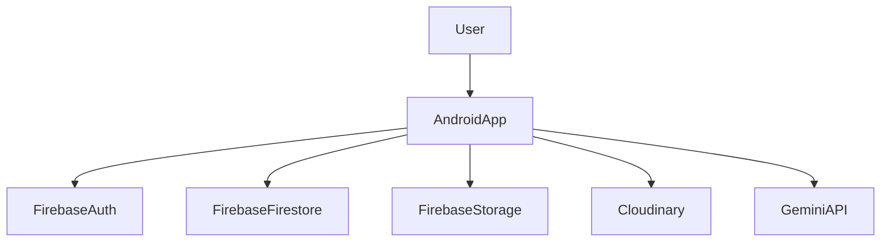

# HerbaMed Jabar

> Android app for herbal plant identification, scan history, and community forum. MVVM architecture, Kotlin, Room, Firebase, Cloudinary, Gemini AI.

HerbaMed Jabar enables users to identify herbal plants via image scanning, maintain scan history, and participate in a community forum. Built with a modern Android stack, it integrates AI, cloud, and local DB.

---

## Technology Stack

- **Language:** Kotlin 2.2.10
- **Android SDK:** Compile SDK 36, minSdk 24, targetSdk 35
- **Build System:** Gradle (Kotlin DSL, AGP 8.13.0)
- **Dependency Injection:** Dagger Hilt (2.57.1)
- **Database:** Room (2.7.2)
- **Async/Background:** Kotlin Coroutines (1.10.2)
- **UI:** AndroidX, Material, ConstraintLayout, ViewBinding, Lottie, Coil
- **Cloud/Backend:** Firebase (Firestore, Auth, Storage, BOM 34.2.0), Cloudinary, Gemini API
- **Other:** CameraX, Markdown rendering

---

## Project Architecture

- **Layered + MVVM:** Presentation, ViewModel, Domain (UseCase), Data (Repository/DAO), DI, Utility
- **Repository Pattern:** Abstracts local (Room) and remote (Firebase, Cloudinary) data sources
- **Dependency Injection:** Dagger Hilt for constructor injection and singleton management
- **Coroutines:** Async/background operations
- **LiveData/Flow:** State and event propagation

### Architecture Diagram



---

## Getting Started

### Prerequisites

- Android Studio (latest recommended)
- JDK 17+
- Android SDK 36+

### Installation

1. Clone the repository:

   ```sh
   git clone https://github.com/nirwanadoteth/HerbaMed-Jabar.git
   cd HerbaMed-Jabar
   ```

2. Add your Firebase config file to `app/google-services.json`.
3. Add required secrets to `local.properties` (see project docs for details).
4. Open in Android Studio and let Gradle sync.
5. Build and run on an emulator or device.

---

## Local configuration (Cloudinary and API keys)

Sensitive values must never be committed to source control. This project reads a small set
of non-sensitive values from `local.properties` for local development only. Do NOT place
Cloudinary API secrets into `local.properties` or emit them into the APK.

Recommended local properties for client-side usage (unsigned uploads):

```properties
# Cloudinary cloud name (required for client uploads)
cloudinaryCloudName=your_cloud_name

# Optional: an unsigned upload preset created in your Cloudinary dashboard.
# When present, the client can use this preset for unsigned direct uploads.
cloudinaryPreset=your_unsigned_preset_name

# API key used by other services (if needed) — keep any secret-server keys off the client.
apiKey=YOUR_API_KEY
```

Security notes:

- For production, prefer server-side signing for uploads. The recommended pattern is:
  1. Client uploads an image to your backend.
  2. Backend signs the Cloudinary upload parameters using your server-side API secret and
     returns a short-lived signature or an upload token to the client.
  3. Client performs the upload with the signature (or the backend uploads on the client's behalf).

- If you use unsigned uploads, restrict the capabilities of the unsigned preset (allowed formats,
  folder paths, incoming transformations) and monitor usage in Cloudinary.

Do not commit `local.properties` or any secrets. Keep production secrets in a secure secret store
or CI environment and never include them in BuildConfig for release builds.

---

## Project Structure

```text
/
  app/
    src/
      main/
        java/edu/unikom/herbamedjabar/
          adapter/        # RecyclerView adapters
          dao/            # Room DAOs
          data/           # Entities (ScanHistory, Post)
          db/             # Room database
          di/             # Hilt DI modules
          migration/      # Room migration manager
          repository/     # Data access abstraction
          useCase/        # Business logic (UseCases)
          util/           # Utilities (Markdown, parsing)
          view/           # Fragments/Activities (UI)
          viewModel/      # ViewModels (UI state)
        res/
          layout/         # XML layouts
          values/         # Strings, colors, themes
  build.gradle.kts        # Root build config
  settings.gradle.kts     # Gradle settings
  gradle/                 # Gradle wrapper, versions
```

---

## Key Features

- **AI-powered plant identification** via image scan
- **Scan history** with local storage and retrieval
- **Community forum** for sharing plant info and discussions
- **Cloud integration**: Firebase Auth, Firestore, Storage, Cloudinary
- **Modern Android UI**: Material, Lottie, Markdown rendering
- **Accessibility and security**: Follows best practices

---

## Development Workflow

- **MVVM + Layered**: Start with Fragment, ViewModel, UseCase
- **Repository pattern**: Abstracts data access
- **Dependency injection**: Hilt modules for all layers
- **Coroutines**: All async/background work
- **Testing**: Unit, integration, UI tests (JUnit, Espresso)
- **Branching**: Feature branches, PRs, code review
- **CI/CD**: (Recommended) GitHub Actions

---

## Coding Standards

- **Naming**: PascalCase for classes, camelCase for variables
- **Organization**: By layer and feature
- **Error handling**: try/catch in ViewModels, UseCases, Repositories
- **Testing**: Unit, integration, UI; mocking via test doubles
- **Documentation**: KDoc for classes/methods, usage examples
- **Accessibility**: Follows WCAG 2.2 AA

---

## License

This project is licensed under [MIT License](LICENSE.md).
